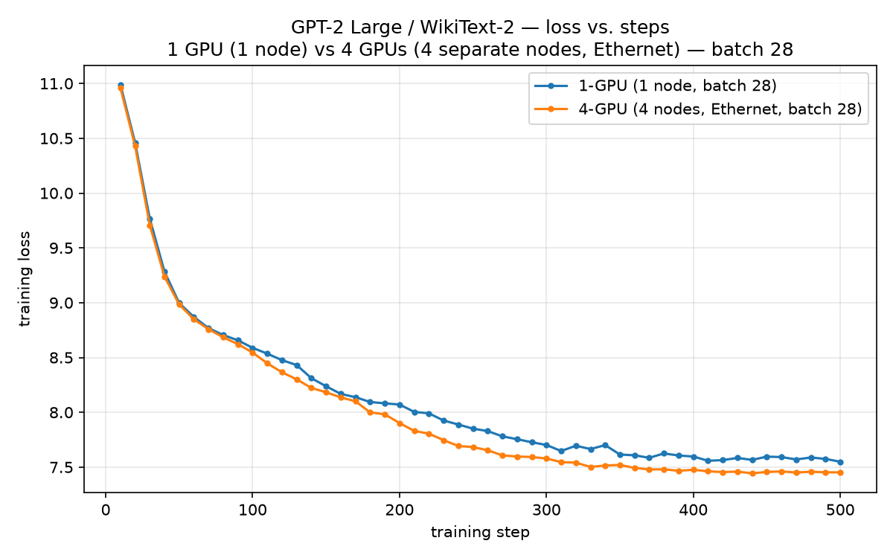
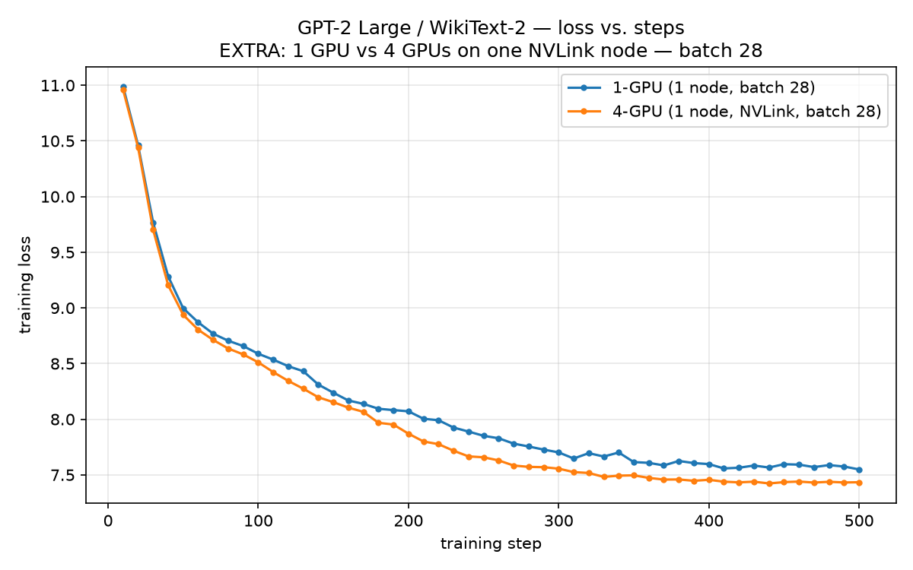
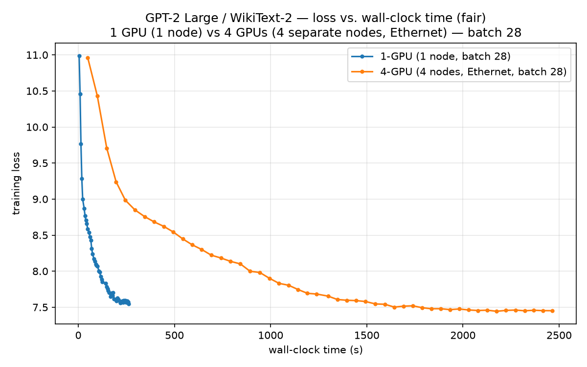
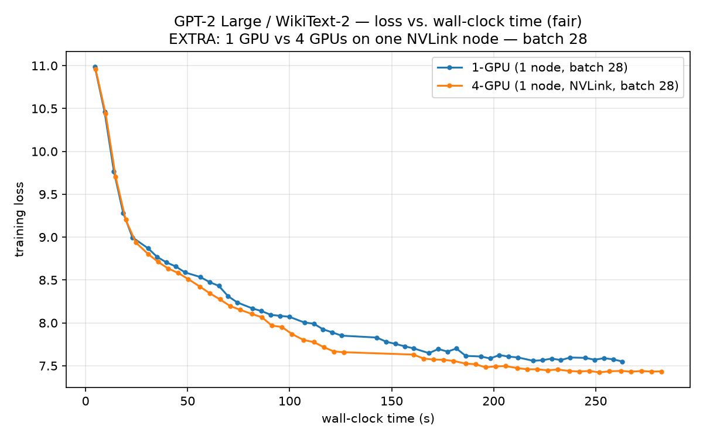
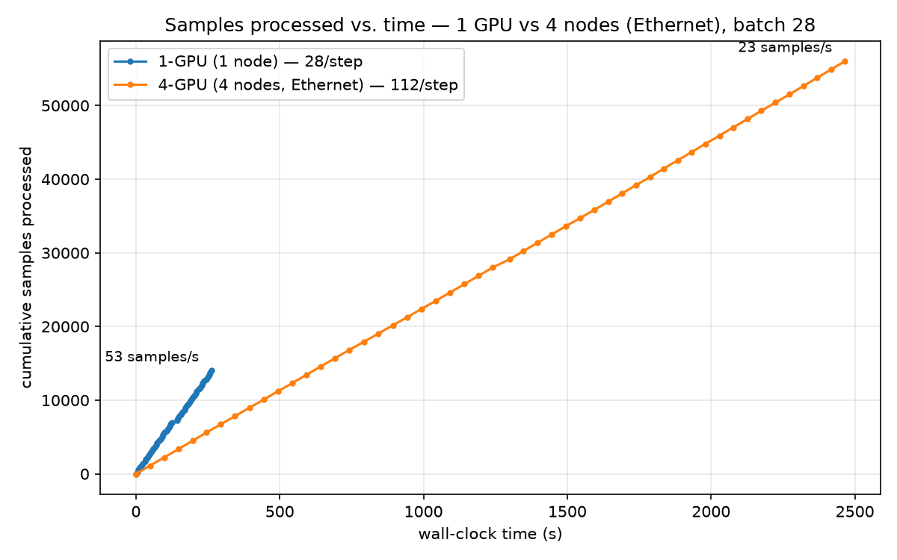

# Scaling LLM Training with PyTorch DDP — Report

GPT-2 Large (~774M) pretraining on WikiText-2, Nebius mk8s + SkyPilot, H100 NVLink nodes.

> **Status:** complete. Every number below is taken from the logs in `logs/`, via
> `python make_report_data.py logs/1gpu_log.txt logs/4gpu_log.txt`.

---

## 1. Maximum per-device batch size

**Probe method.** With `num_nodes: 1`, launch the job with increasing
`PER_DEVICE_TRAIN_BATCH_SIZE` and stop each probe as soon as the first few steps are
logged (no need to run to completion — OOM, if it happens, happens on the first backward
pass). A step ~10 reached without `torch.OutOfMemoryError` = fits. Two passes: a
power-of-2 sweep to bracket the limit, then a fine search to pin the exact boundary.

**Pass 1 — power-of-2 sweep** (brackets the limit between 16 and 32):

| `PER_DEVICE_TRAIN_BATCH_SIZE` | Result | Log |
|---|---|---|
| 1 | OK | `logs/probe_bs1.txt` |
| 2 | OK | `logs/probe_bs2.txt` |
| 4 | OK | `logs/probe_bs4.txt` |
| 8 | OK | `logs/probe_bs8.txt` |
| 16 | OK | `logs/probe_bs16.txt` |
| 32 | **OOM** | `logs/probe_bs32.txt` |

**Pass 2 — fine search in (16, 32]** to find the true maximum:

| `PER_DEVICE_TRAIN_BATCH_SIZE` | Result | Log |
|---|---|---|
| 28 | OK | `logs/probe_bs28.txt` |
| 30 | OK | `logs/probe_bs30.txt` |
| 31 | **OOM** | `logs/probe_bs31.txt` |
| 32 | **OOM** | `logs/probe_bs32.txt` |

Boundary pinned at **30 OK / 31 OOM** (adjacent). OOM at 31 (`logs/probe_bs31.txt`):

```
torch.OutOfMemoryError: CUDA out of memory. Tried to allocate 2.97 GiB.
GPU 0 has a total capacity of 79.18 GiB of which 1.23 GiB is free.
```

**Answers.** The assignment's power-of-2 rule (pass 1) gives **16** — the largest
power of 2 that runs. The finer search (pass 2) shows the true hardware maximum is
**30** (30 OK / 31 OOM).

**Batch size used for all training runs: 28.** Chosen as the safe maximum rather than the
true-max 30: at 30 only ~1.2 GB is free, so once CUDA-allocator fragmentation and the
same-size eval batch are added a full 500-step run risks an OOM mid-flight; 28 leaves
comfortable headroom while still saturating the GPU. Applied **identically** across all
runs — 1-GPU (1 node), 4-GPU (4 nodes, Ethernet), and 4-GPU (1 node, NVLink) — as step 2
requires, so every comparison in this report is same-batch and fair.

*(The power-of-2 rule in pass 1 would give 16; the fine search shows 30 is the real
hardware ceiling and 28 the safe operating point actually used.)*

*Static memory budget (why the answer lands where it does):* AdamW keeps fp32
master weights + fp32 gradients + 2 fp32 moments ≈ 16 bytes per parameter.
774,030,080 × 16 B ≈ **12.4 GB** of optimizer/gradient state that does not depend
on batch size at all. On an 80 GB H100 that leaves ≈ 67 GB for activations, which
is what the batch size is actually trading against at `BLOCK_SIZE=512`.

## 2. Model verification — GPT-2 Large ✅

`train.py` (`GPT2Config`, around line 165) is set to the GPT-2 paper's Table 2
"762M" row:

```python
config = GPT2Config(
    vocab_size=50257,
    n_positions=1024,   # standard GPT-2 context window
    n_embd=1280,        # GPT-2 Large
    n_layer=36,         # GPT-2 Large
    n_head=20,          # GPT-2 Large
    bos_token_id=50256,
    eos_token_id=50256,
)
```

`d_head = n_embd / n_head = 1280 / 20 = 64`, as the standard GPT-2 family requires.

Parameter count, derived from the config (token embedding 50257×1280 +
position embedding 1024×1280 + 36 × 19,677,440 per block + final LayerNorm;
`lm_head` is weight-tied to `wte` so it adds nothing):

**774,030,080 parameters ≈ 774M.**

Confirmed in the log:

```
[Comm] Trainable parameters: 774,030,080
[Comm] Theoretical grad payload / step (fp32): 3,096,120,320 bytes
[Comm] Theoretical ring all-reduce bytes/GPU/step: 4,644,180,480 bytes   (world_size=4)
```

The two theoretical figures follow directly: 774,030,080 × 4 B = **3.096 GB** of
fp32 gradients per step, and a ring all-reduce moves
2 × (4−1)/4 × 3.096 GB = **4.644 GB per GPU per step**.

> **All runs below use per-device batch 28**, so every comparison is apples-to-apples
> (identical work per GPU, only GPU count / interconnect differ). The **required**
> comparison is **1-GPU (1 node) vs 4-GPU (4 separate nodes)**; the 1-node/4-GPU NVLink
> run is shown as an **extra** (`*_nvlink.png`) to isolate the interconnect's effect.

## 3. Loss vs. steps

**Required — 1-GPU (1 node) vs 4-GPU (4 separate nodes, Ethernet), batch 28:**



Both runs start near the random-init loss (≈10.9 ≈ ln 50257) and descend. At the same
step number the 4-GPU curve sits **lower** — final eval loss 6.78 vs 6.88 — because at a
fixed 500 steps its global batch is 4 × 28 = 112 vs 28, so it sees 4× the tokens (11.6
epochs vs 2.96). That is a batch effect, *not* a speedup; whether those 500 steps
*finished sooner* is section 4 (they did not — the 4-node run took ~9× longer).

**Extra — 1-GPU vs 4-GPU on one NVLink node, batch 28:**



## 4. Loss vs. wall-clock time (fair comparison)

**Required — 1-GPU (1 node) vs 4-GPU (4 separate nodes, Ethernet), batch 28:**



The honest comparison — loss against wall-clock. The single GPU finishes its 500 steps in
**276 s**; the 4-node run takes **2478 s** — **~9× longer** — for the same 500 steps, so at
any equal wall-clock budget the single GPU is far down the curve while the 4-node run is
still near the top. **DDP across 4 Ethernet-connected nodes is dramatically slower**, and
section 8 shows the cause is entirely gradient communication over the network.

**Extra — 1-GPU vs 4-GPU on one NVLink node, batch 28:**



The NVLink picture is the opposite: 1-GPU 276 s vs 4-GPU 312 s for 500 steps (near-equal),
but the 4-GPU run does 4× the data in that time, so its loss is lower at equal wall-clock —
**3.54× throughput**. Same model, same DDP, same batch as the 4-node run; **only the wire
between GPUs differs** (section 8).

## 5. Training throughput

All three runs use **per-device batch 28** and the same 500 steps. Columns 1–2 are the
assignment's required comparison (1-GPU vs 4 *separate* nodes); column 3 is the extra
single-node NVLink run.

| Metric | 1-GPU (1 node) | **4-GPU (4 nodes, Ethernet)** | 4-GPU (1 node, NVLink) |
|---|---|---|---|
| `train_runtime` (s) | 276.2 | **2478.0** | 311.7 |
| `train_samples_per_second` | 50.68 | **22.60** | 179.6 |
| `train_steps_per_second` | 1.810 | 0.202 | 1.604 |
| Avg step time from `[Comm]` (s) | 0.4540 | 4.9560 | 0.4956 |

**Same-batch speedups vs the 1-GPU baseline (the honest scaling numbers):**

- **4 GPUs, 4 nodes over Ethernet: `22.60 / 50.68 = 0.45×` — DDP made it *slower than one
  GPU*.** ~11% of ideal linear 4×.
- 4 GPUs, 1 node over NVLink: `179.6 / 50.68 = 3.54×` — 89% of ideal linear 4×.

**Note on `train_runtime`.** It is wall-clock for a *fixed 500 steps*, and a step is not
equal work across runs (the 4-GPU runs have global batch 4 × 28 = 112 vs 28, so 500 steps =
56,000 samples vs 14,000). Compare **`samples_per_second`**, not `train_runtime` — the
4-node run's 2478 s is ~9× the 1-GPU's 276 s *and* it only kept 4 GPUs busy 22.6 samples/s,
so it loses on both counts.

**Samples processed vs. wall-clock time** (required 1-GPU vs 4-node pair) makes throughput
visual — the slope *is* samples/second:



The 1-GPU line climbs faster than the 4-node line despite using ¼ the GPUs: over Ethernet,
4 GPUs process fewer samples per second than one, because each step stalls ~4.4 s on the
gradient all-reduce. On NVLink the 4-GPU slope would be ~4× the 1-GPU (see the extra graphs).

## 6. Inference (evaluation) throughput

All batch 28, final `[Inference]` evaluation:

| Metric | 1-GPU (1 node) | 4-GPU (4 nodes, Ethernet) | 4-GPU (1 node, NVLink) |
|---|---|---|---|
| `eval_samples_per_second` | 171.811 | 598.654 | 599.732 |
| `eval_runtime` (s) | 2.904 | 0.834 | 0.832 |
| `eval_loss` | 6.8789 | 6.7779 | 6.7623 |

Inference scales **~3.5× on both** 4-GPU runs — `598.7 / 171.8 = 3.48×` — and crucially the
4-node run scales just as well as NVLink **despite** its terrible training throughput. Why:
evaluation has **no gradients**, so there is no 3.1 GB all-reduce per step — HF `Trainer`
just shards the eval set across the 4 ranks and does one tiny metric gather at the end. The
interconnect barely matters when there is almost nothing to send. This is the clean control
that pins the training slowdown on gradient communication specifically (section 8).

## 7. Communication numbers

Communication only exists for the 4-GPU runs (1-GPU = 0 by construction). Both 4-GPU
runs use **batch 28** and move the *identical* 1.548 TB of gradients — same model, same
500 steps, same bytes — so this table isolates the wire:

| Metric | **4-GPU, 4 nodes (Ethernet)** | 4-GPU, 1 node (NVLink) |
|---|---|---|
| Total measured comm time (s) | **2204.88** | 9.88 |
| Total measured comm bytes | 1,548,060,160,000 | 1,548,060,160,000 |
| Avg comm time per all-reduce (s) | 0.040537 | 0.000182 |
| Avg comm time per optimizer step (s) | 4.409755 | 0.019762 |
| Effective bandwidth (bytes/time) | **~0.70 GB/s** | ~157 GB/s |
| Theoretical grad payload per step | 3,096,120,320 B | 3,096,120,320 B |
| NCCL transport (from log) | **`NET/Socket`** (TCP/Ethernet) | `P2P/CUMEM` (NVLink) |

*(1-GPU: 0 comm — no hook registered when `world_size < 2`, theoretical ring
bytes/GPU/step = 0.)*

**The controlled experiment.** The only variable between the two columns is GPU placement
— 4 separate nodes over the Cilium Ethernet pod-network vs 4 GPUs in one box over NVLink.
Comm time drops from **2204.9 s to 9.88 s — 223× — and effective bandwidth rises ~0.70 →
~157 GB/s.** This isolates the entire training slowdown of the 4-node run to inter-node
networking, not DDP itself. The NCCL log makes the wire explicit: the 4-node run negotiates
every channel `via NET/Socket/0` (TCP over Ethernet), the NVLink run `via P2P/CUMEM`.

**Does the measured communication time explain the gap?** The 4-node step takes ~4.96 s vs
the 1-GPU's ~0.45 s — an extra ~4.51 s, and the measured all-reduce is **4.41 s/step**.
The two match closely — **communication accounts for essentially all of the slowdown.**
Compute per step is ~0.45 s either way; the 4-node step spends ~10× longer, and almost all
of it is gradient synchronisation over the network. Effective bandwidth
`1.548e12 / 2204.88 ≈ 0.70 GB/s` is ~100× below an H100 NIC's line rate — the traffic
crosses the Cilium software overlay on plain Ethernet, with no NVLink and no InfiniBand
(see section 8).

## 8. Did DDP improve performance?

**It depends entirely on the interconnect — and that is the whole lesson.** DDP itself
was never the problem; the fabric between the GPUs is. Two 4-GPU runs, identical except
for GPU placement, land on opposite sides of the answer:

- **4 GPUs on 4 separate nodes (Ethernet): No — slower than one GPU.** 22.60 vs 50.68
  samples/s = **0.45×**, ~11% efficiency against ideal 4×.
- **4 GPUs on 1 node (NVLink): Yes — 3.54× faster.** 179.6 vs 50.68 samples/s = **3.54×**,
  89% of ideal linear 4×, comm overhead just `0.0198 / 0.496 ≈ 4%` of each step.

### Summary — all three runs (all batch 28)

| Run | GPUs × nodes | Interconnect | samples/s | comm time (whole run) | comm/step | scaling vs 1-GPU |
|---|---|---|---|---|---|---|
| 1-GPU baseline | 1 × 1 | — (nothing to sync) | 50.68 | 0 s | 0 s | 1× (reference) |
| **4-GPU, 4 nodes (required)** | 4 × 4 | **Ethernet** — no NVLink, no InfiniBand | **22.60** | 2204.9 s | 4.410 s | **0.45×** (slower than 1 GPU) |
| 4-GPU, 1 node (extra) | 4 × 1 | **NVLink** (`P2P/CUMEM`) | 179.6 | 9.88 s | 0.0198 s | **3.54×** |

### Why the required 4-node run is so slow — no NVLink and no InfiniBand

Same model, same 1.548 TB of gradient traffic in both 4-GPU runs — the **only** difference
is the wire, and the two fast fabrics are simply **not available** across separate 1-GPU
nodes:

- **NVLink** is an *intra-node* fabric — it connects GPUs **inside one chassis**. Four GPUs
  in one box get it (the extra run: ~157 GB/s). Four GPUs in **four separate boxes** cannot
  — there is no NVLink between machines, by definition.
- **InfiniBand/RDMA** is the *inter-node* HPC fabric that would make cross-node all-reduce
  fast. It requires **InfiniBand-equipped nodes** (Mellanox `mlx5` NICs in an IB GPU-cluster
  fabric). The sliced **1-GPU** node preset (`1gpu-16vcpu-200gb`) used here has **no IB
  hardware**, so the NCCL IB settings staged in the config (`NCCL_IB_HCA=mlx5`,
  `NCCL_IB_DISABLE=0`) have nothing to bind to.
- **What's left is plain Ethernet.** The NCCL log confirms every channel is negotiated
  `via NET/Socket/0` — TCP/IP across the Cilium software overlay. Measured ~**0.70 GB/s**.

**To get both NVLink and InfiniBand you would need 4 nodes × 8-GPU H100 hosts** (`gpu-h100-sxm`
full-node, 8 GPUs each): NVLink links the 8 GPUs *within* each node and InfiniBand links the
*nodes* together — the standard multi-node H100 training topology. **That node type was not
available on this account (no quota)**, so the required 4-node experiment could only run on
sliced 1-GPU nodes over Ethernet. That hardware limit — not DDP, not the model — is why it
is slow.

**The arithmetic of the slowdown.** At ~0.70 GB/s the 3.096 GB fp32 gradient takes ~4.4 s to
all-reduce *every step*, while compute is only ~0.45 s — so the GPUs sit idle ~**90%** of
each step waiting on the network (comm 4.41 s of a 4.96 s step). The measured extra step time
(~4.51 s over the 1-GPU baseline) is almost exactly the measured all-reduce time (4.41 s):
**communication is the entire penalty.** Put the same 4 GPUs in one NVLink box and comm drops
223× to 0.0198 s/step — 4% of the step — and DDP flips from **0.45× to 3.54×**.

- **Inference is the opposite, and near-ideal.** `eval_samples_per_second` scaled
  **598.7 / 171.8 = 3.49×** on NVLink and even the 4-node run hit **598.7** — evaluation has
  no gradients, hence no 3.1 GB all-reduce, only a tiny metric gather, so it scales well
  *regardless of interconnect*. This cleanly isolates the cause: the training penalty is
  gradient synchronisation over a slow wire, nothing else.

The one training-side benefit of the 4-node run is memory/tokens, not speed: the 4× larger
effective batch saw 11.6 epochs in 500 steps and reached a slightly lower loss (section 3) —
but that is a batch-size effect obtainable on 1 GPU with gradient accumulation, and it cost
9× the wall-clock.

## 9. Options for improvement

Ordered by expected payoff for *this* configuration, each tied to the measured
numbers above.

1. **Gradient accumulation / larger per-device batch.** The all-reduce payload is
   3.096 GB per step regardless of batch size. Doubling the work per step halves
   the number of all-reduces for the same number of samples, so the fixed
   communication cost is amortised over twice the compute. Cheapest change:
   raise `GRADIENT_ACCUMULATION_STEPS` — DDP's `no_sync()` path means the
   intermediate micro-batches skip the all-reduce entirely.
2. **bf16 gradient communication.** Gradients are all-reduced in fp32 today
   (3.096 GB). A bf16 comm hook
   (`torch.distributed.algorithms.ddp_comm_hooks.default_hooks.bf16_compress_hook`)
   halves that to ~1.55 GB per step at negligible quality cost for pretraining —
   a one-line change next to the existing `_make_timed_allreduce_hook`.
3. **Faster interconnect — the biggest lever here.** These are 4 separate 1-GPU nodes, so
   every byte crosses the network, not NVLink. Measured effective bandwidth is only
   `1.548 TB / 2204.9 s ≈ 0.70 GB/s`, ~100× below an H100 node's NIC line rate — the
   Cilium Ethernet overlay is the bottleneck. **InfiniBand between nodes** (needs IB-capable
   multi-GPU hosts), or **4 GPUs inside one NVLink node**, removes almost the entire
   4.4 s/step penalty — the NVLink run (section 7) shows it directly: comm 2204.9 s → 9.88 s,
   0.45× → 3.54×.
4. **Better comm/compute overlap.** DDP already overlaps bucket all-reduces with
   the backward pass; tuning `bucket_cap_mb` upward reduces per-bucket latency
   overhead on a 774M model, where the default 25 MB buckets mean ~124 separate
   all-reduce calls per step. Compare `measured avg comm time / all-reduce call`
   × `num_allreduces` against the per-step total to see how much is latency
   rather than bandwidth.
5. **FSDP / ZeRO instead of DDP.** DDP replicates all 12.4 GB of optimizer and
   gradient state on every GPU. Sharding it (ZeRO-2/3, FSDP) frees memory for a
   much larger per-device batch — which then feeds directly back into point 1.
   It changes the collective from all-reduce to reduce-scatter + all-gather,
   moving a comparable number of bytes but removing the memory ceiling.
6. **Gradient compression.** PowerSGD (`powerSGD_hook`) cuts the payload by an
   order of magnitude. Only worth it if section 7 shows communication dominating,
   as it costs some convergence quality.

---

## Reproducing the numbers in this report

```bash
python make_report_data.py logs/1gpu_log.txt logs/4gpu_log.txt
```

Writes `graphs/loss_vs_steps.png` and `graphs/loss_vs_time.png`, and prints the
tables for sections 5, 6 and 7.
